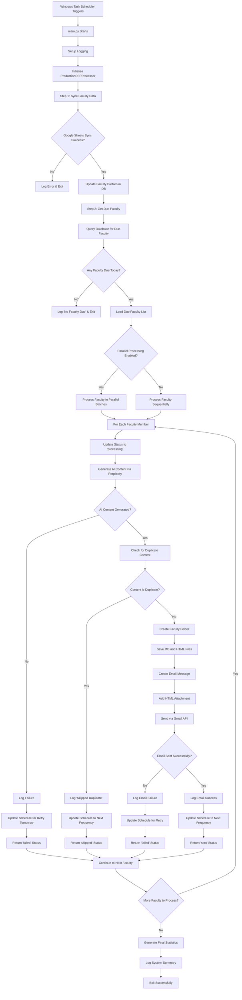
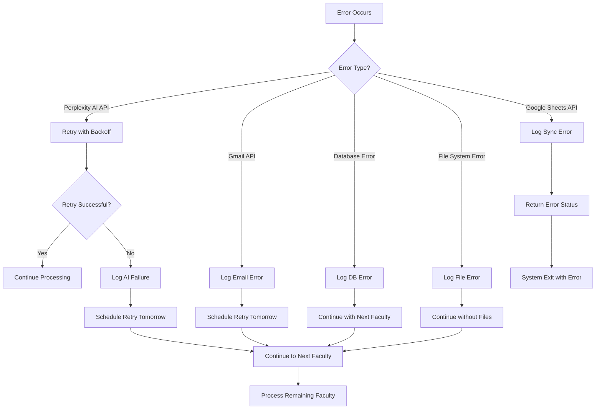
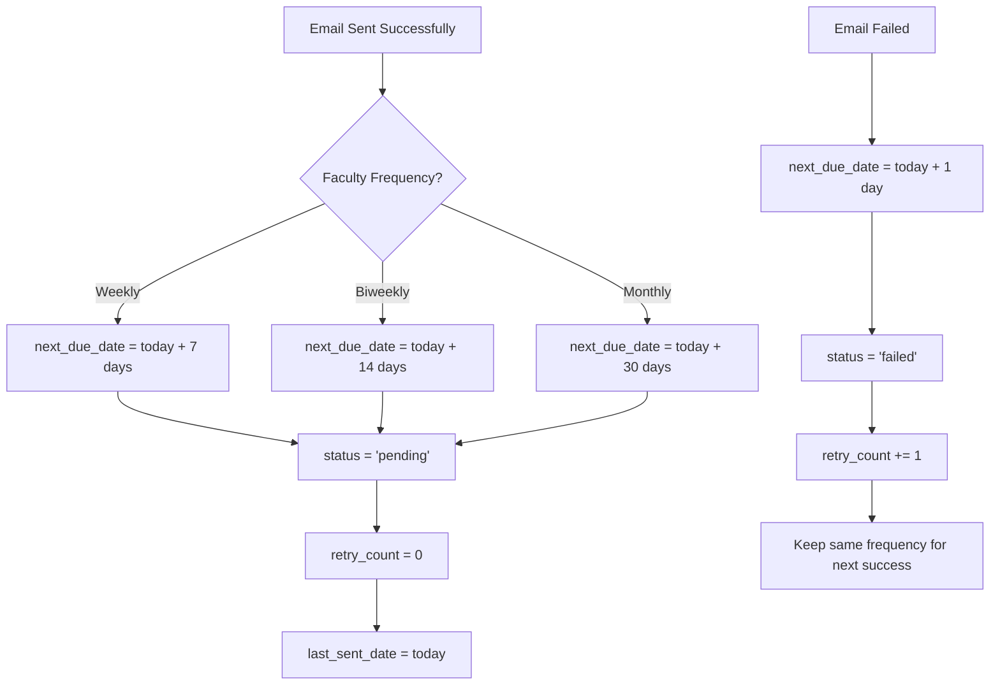
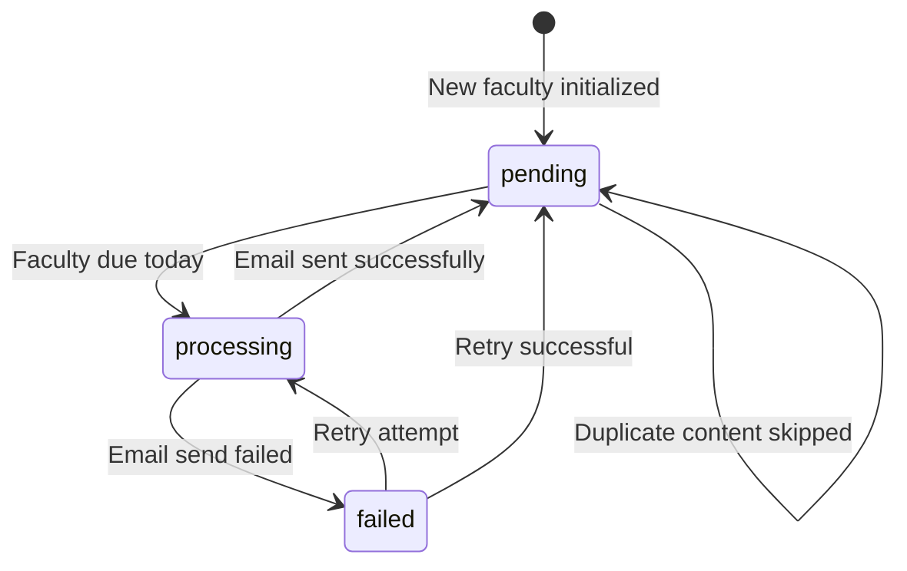

# RFP System Email Delivery Flow

## Complete Email Delivery Workflow



## Detailed Step-by-Step Email Delivery Process

### Phase 1: System Initialization
```
1. Windows Task Scheduler → Triggers at 9:00 AM daily
2. Executes run_rfp_production.bat
3. Calls python main.py
4. Sets up logging (logs/rfp_system_YYYYMMDD.log)
5. Initializes ProductionRFPProcessor
```

### Phase 2: Data Synchronization
```
6. Connect to Google Sheets API
7. Fetch latest faculty form responses
8. Process and validate faculty data
9. Update/Insert faculty profiles in SQLite database
10. Initialize schedules for new faculty members
```

### Phase 3: Faculty Selection
```
11. Query database for faculty due today:
    - WHERE next_due_date <= TODAY
    - AND active = TRUE  
    - AND status IN ('pending', 'failed')
12. Order by due_date ASC, retry_count ASC
13. Load faculty data with research preferences
```

### Phase 4: Individual Faculty Processing

#### For Each Faculty Member:

**Step A: Status Update**
```
14. Update email_schedule.status = 'processing'
15. Log start of processing for faculty
```

**Step B: AI Content Generation**
```
16. Build personalized prompt using:
    - Research area
    - Keywords  
    - Eligibility constraints
    - Funding preferences
    - Timeline requirements
17. Call Perplexity API with custom prompt
18. Receive AI-generated RFP opportunities
19. Track tokens used and processing time
```

**Step C: Duplicate Prevention**
```
20. Generate MD5 hash of content
21. Check email_history for same hash in last 7 days
22. If duplicate found:
    - Log as 'skipped_duplicate'
    - Update schedule to next frequency
    - Continue to next faculty
```

**Step D: File Management**
```
23. Create faculty-specific folder: output/faculty/username/
24. Generate filenames: username_YYYY-MM-DD.md/.html
25. Save markdown content to .md file
26. Convert to HTML with styling and metadata
27. Save HTML file with proper formatting
```

**Step E: Email Composition**
```
28. Create EmailMessage object
29. Set recipients:
    - To: faculty_email
    - From: icc-intake@mtu.edu
    - CC: ajstump@mtu.edu, townsend@mtu.edu
30. Set subject: "ICC AI-Enabled RFP Results for [username], [date]"
31. Add email template body
32. Attach HTML file
```

**Step F: Email Delivery**
```
33. Authenticate with Gmail API
34. Encode message to base64
35. Send via Gmail API
36. Receive message ID or error
```

**Step G: Result Processing**
```
37. If SUCCESS:
    - Log to email_history with 'success' status
    - Calculate next_due_date based on frequency
    - Reset retry_count to 0
    - Update schedule status to 'pending'

38. If FAILURE:
    - Log to email_history with 'failed' status
    - Set next_due_date to tomorrow (retry)
    - Increment retry_count
    - Update schedule status to 'failed'
```

### Phase 5: Batch Completion
```
39. Collect statistics from all faculty processing
40. Generate summary:
    - Total processed
    - Emails sent successfully  
    - Emails failed
    - Emails skipped (duplicates)
41. Log final system summary
42. Exit with appropriate status code
```

## Error Handling Flow



## Frequency-Based Scheduling Logic



## File Organization Structure

```
output/
└── faculty/
    ├── username1/
    │   ├── username1_2025-09-15.md
    │   ├── username1_2025-09-15.html
    │   ├── username1_2025-09-22.md
    │   └── username1_2025-09-22.html
    ├── username2/
    │   ├── username2_2025-09-15.md
    │   └── username2_2025-09-15.html
    └── username3/
        └── username3_2025-09-15.md
```

## Database State Changes



## Monitoring and Logging

### Log Entries Created:
1. **System Start/Stop**: Timestamps and duration
2. **Faculty Sync**: Records processed, new, updated
3. **Individual Processing**: Start/end times per faculty
4. **AI Generation**: Token usage, processing time
5. **Email Delivery**: Success/failure with message IDs
6. **Errors**: Detailed error messages and stack traces
7. **Performance**: Processing times and resource usage

### Database Records:
1. **email_history**: Complete audit trail of all emails
2. **system_logs**: System events and performance data
3. **email_schedule**: Current schedule state for each faculty
4. **faculty_profiles**: Updated faculty information

This flow ensures reliable, automated email delivery with comprehensive error handling, duplicate prevention, and detailed monitoring for the RFP system.
